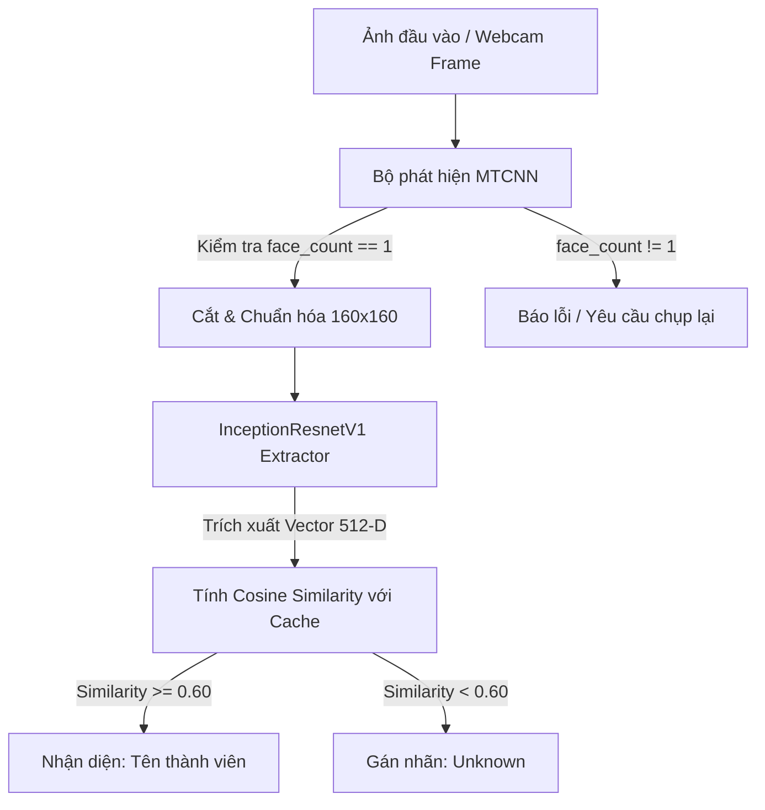

# Face Recognition Streamlit Dashboard

<p align="center">
  
  
  
  
  
</p>

Một giải pháp nhận diện khuôn mặt cục bộ (On-premise Face Recognition) hoàn chỉnh, hiệu năng cao được xây dựng trên nền tảng **PyTorch**, **Streamlit** và mô hình **FaceNet (InceptionResnetV1)**. Hệ thống cho phép nhận diện các thành viên trong nhóm trực tiếp qua Webcam hoặc file ảnh tải lên mà không cần huấn luyện lại mô hình (Zero-Shot Learning).

---

## 📌 Mục lục
1. [Tính Năng Chính](#-tính-năng-chính)
2. [Nguyên Lý Hoạt Động](#-nguyên-lý-hoạt-động)
3. [Cấu Trúc Thư Mục Dữ Liệu](#-cấu-trúc-thư-mục-dữ-liệu)
4. [Hướng Dẫn Cài Đặt Nhanh](#-hướng-dẫn-cài-đặt-nhanh)
5. [Đóng Gói với Docker](#-đóng-gói-với-docker)
6. [Kiểm Thử (Unit Tests)](#-kiểm-thử-unit-tests)
7. [Giấy Phép](#-giấy-phép)

---

## 🛠️ Tính năng chính

* **Nhận diện thời gian thực (Real-time Inference)**: Quét và nhận diện khuôn mặt trực tiếp qua Webcam hoặc qua tệp tải lên. Tự động vẽ khung bounding box và gắn tên nhãn kèm độ tin cậy.
* **Quy trình đăng ký 5 góc mặt chuẩn hóa (Guided Capture)**: Trình hướng dẫn webcam tự động dẫn dắt người dùng qua 5 góc mặt (Chính diện, Quay trái, Quay phải, Ngẩng lên, Cúi xuống) để tối ưu hóa góc nhận dạng của camera.
* **Tải lên hàng loạt (Bulk Upload)**: Kéo thả nhiều ảnh cùng lúc, hệ thống tự động xác minh từng ảnh chứa đúng 1 khuôn mặt trước khi nạp vào bộ nhớ.
* **Quản lý dữ liệu trực quan**: Xem hình ảnh mẫu của từng người dùng và thực hiện thao tác xóa dữ liệu trực tiếp trên bảng điều khiển.
* **Light Mode UI tối giản**: Thiết kế giao diện hiện đại theo chuẩn màu Cyan/Green thân thiện, chuyên nghiệp.

---

## 🧠 Nguyên lý hoạt động

Ứng dụng sử dụng pipeline xử lý ảnh 3 giai đoạn được tối ưu hóa hiệu năng (chỉ chạy mô hình mạng neural một lần duy nhất per photo):



---

## 📂 Cấu trúc thư mục dữ liệu

Dữ liệu khuôn mặt của thành viên được lưu dưới dạng ảnh mẫu cục bộ:
```text
data/
└── registered_faces/
    ├── NguyenVanA/
    │   ├── front.png
    │   ├── left.png
    │   └── right.png
    └── TranThiB/
        └── 1718432380789.png
```
Hệ thống tự động nạp toàn bộ ảnh mẫu này vào bộ nhớ đệm (RAM Cache) dưới dạng vector đặc trưng khi khởi động hoặc reload, giúp việc so khớp diễn ra với độ trễ gần như bằng 0.

---

## 💻 Hướng dẫn cài đặt nhanh

### 1. Cài đặt môi trường Python (3.12+)
Khuyên dùng môi trường ảo `conda` hoặc `venv`.

```bash
# Cài đặt các thư viện phụ thuộc
pip install -r requirements.txt
```

### 2. Khởi động Streamlit Dashboard
```bash
streamlit run app.py
```
Ứng dụng sẽ tự động mở trên trình duyệt của bạn tại địa chỉ: `http://localhost:8501`.

---

## 🐳 Đóng gói với Docker

Sử dụng Docker giúp ứng dụng chạy cô lập, không phụ thuộc vào thư viện trên máy chủ của bạn.

### 1. Build Docker Image
```bash
docker build -t face-rec-app .
```

### 2. Khởi động Container (Mount Volume lưu dữ liệu)
```bash
docker run -d -p 8501:8501 -v "$(pwd)/data:/app/data" --name face-rec-container face-rec-app
```

### 3. Các lệnh điều khiển Container
```bash
# Tạm dừng container
docker stop face-rec-container

# Khởi chạy lại container đã dừng
docker start face-rec-container

# Xóa bỏ container hoàn toàn (không ảnh hưởng dữ liệu data mẫu)
docker stop face-rec-container && docker rm face-rec-container
```

---

## 🧪 Kiểm thử (Unit Tests)

Dự án sử dụng `pytest` kết hợp với fixture `tmp_path` để chạy kiểm thử cô lập hoàn toàn cho Face Engine:

```bash
pytest test_face_engine.py -v
```

Kết quả kiểm thử bao gồm các bài test về:
* Tạo thư mục tự động
* Trích xuất embedding 512 chiều
* Tính khoảng cách cosine
* Bảo mật chống tấn công Path Traversal
* Khớp ảnh mẫu và cập nhật Cache tăng tốc

---

## 📄 Giấy phép

Phân phối dưới giấy phép **MIT License**. Xem chi tiết tại tệp `LICENSE` nếu có.
